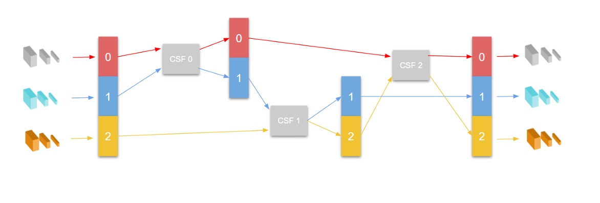

# Braid-Normalizing-Flow
Braid Normalizing Flows is a model of Anomaly Detection of images based of CS-Flow that uses a triplet of images to train. This is useful if we want to use sidelight images of an object during the training.

I chose to call it Braid Normalizing
 Flow because the structure vaguely remembers the process of making a braid: there are
 three branches that are combined following a rotation sequence of actions. The input
 of the architecture is the same as the CS-Flow with sidelight images, a concatenation
 of the tensors of features of the three resize and the three types of images. The input,
 however, is immediately separated in three blocks, that are named 0, 1, and 2. Block 0
 contains the three tensors of features of the three resize of the diffuse image. Blocks 1 and
 2 contain the same, but respectively from the sidelight image 1 and the sidelight image
 2 . We select blocks 0 and 1, we concatenate them, and we pass them to CSF0, which is
 a CS-Flow coupling flow. Since all the permutation layers are deactivated, we are certain
 that the output maintains the feature order of the input. The net separates again the
 output in the two blocks. In CSF1, blocks 1 obtained from CSF0 and blocks 2, which is
 still unchanged, are used as input. CSF2 takes blocks 0 from CSF0 and blocks 2 from
 CSF1 as inputs. Finally, blocks 0, 1, and 2 are concatenated and returned as output by
 the braid normalizing flow. In this sequence, each block interacts with every other block
 before being returned as output and each CS-Flow learns its own parameters. These
 interactions mimic the comparison of an expert analyzing the three different images to
 spot the anomalies.

This project was created thanks to the WACV 2022 paper "Fully Convolutional Cross-Scale-Flows for Image-based Defect Detection" by Marco Rudolph, Tom Wehrbein, Bodo Rosenhahn and Bastian Wandt. (https://github.com/marco-rudolph/cs-flow)

## License

This project is licensed under the MIT License.
